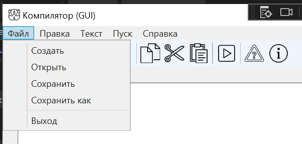
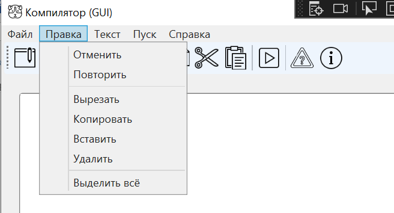
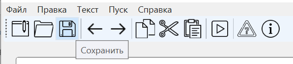
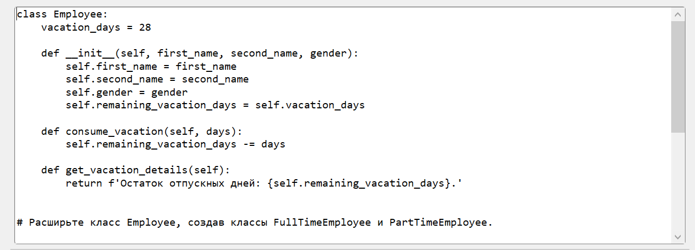
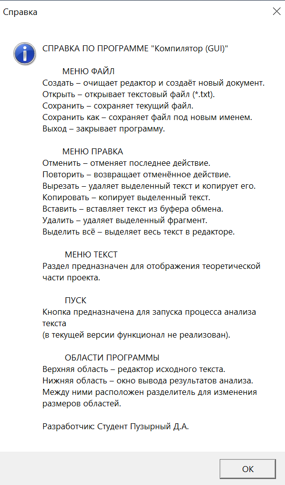
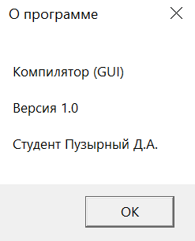

# Лабораторная работа №1  
## Разработка графического интерфейса компилятора (WPF)

---

## 1. Описание проекта

В рамках лабораторной работы разработано настольное приложение «Компилятор (GUI)», реализованное на платформе WPF с использованием языка C#.

Приложение представляет собой графическую оболочку для работы с текстовыми файлами и является заготовкой среды для последующей реализации анализатора формальных языков.

### Реализованные функции:

- создание нового документа;
- открытие текстового файла (*.txt);
- сохранение и сохранение «как»;
- редактирование текста (отмена, повтор, вырезать, копировать, вставить, удалить, выделить всё);
- предупреждение о несохранённых изменениях;
- панель инструментов с графическими кнопками;
- область вывода результатов;
- встроенная система справки.

### Интерфейс состоит из:

- верхней области — редактор текста;
- нижней области — окно вывода;
- строки меню;
- панели инструментов;
- разделителя для изменения размеров панелей.

---

## 2. Используемые технологии

- Язык программирования: C#
- Платформа: .NET Framework 4.7.2
- Фреймворк GUI: Windows Presentation Foundation (WPF)
- Среда разработки: Microsoft Visual Studio 2022
- Система контроля версий: Git
- Репозиторий: GitHub

---

## 3. Инструкция по сборке и запуску

### 3.1 Запуск готового приложения

Готовый исполняемый файл находится в каталоге:

bin/x64/Release/

Запуск осуществляется двойным щелчком по файлу:

ТФЯК №1.exe

---

### 3.2 Сборка из исходного кода

#### Требования:

- Windows 10 или выше
- Установленный .NET Framework 4.7.2
- Microsoft Visual Studio 2019/2022
- Рабочая нагрузка «Разработка классических приложений .NET»

#### Шаги сборки:

1. Открыть файл решения (.sln) в Visual Studio.
2. В верхней панели выбрать конфигурацию **Release**.
3. Выбрать платформу **x64**.
4. Выполнить:  
   **Сборка → Перестроить решение.**

---

## 4. Руководство пользователя

### 4.1 Меню «Файл»

Позволяет:

- Создать новый документ
- Открыть файл
- Сохранить
- Сохранить как
- Выйти из программы

При наличии несохранённых изменений выводится предупреждающее окно.

  

---

### 4.2 Меню «Правка»

Содержит стандартные операции редактирования:

- Отменить
- Повторить
- Вырезать
- Копировать
- Вставить
- Удалить
- Выделить всё

Все действия применяются к тексту в редакторе.

  

---

### 4.3 Панель инструментов

Содержит графические кнопки быстрого доступа к основным функциям.  
При наведении курсора отображаются всплывающие подсказки (ToolTip).

---

  

### 4.4 Область редактора

Предназначена для ввода и редактирования текста.  
Поддерживает прокрутку и перенос строк.

---

  

### 4.5 Область вывода

Используется для отображения результатов обработки текста.  
В текущей версии служит информационным полем.

---

  

### 4.6 Справка

Меню → Справка → Вызов справки  
Отображает описание функциональных возможностей программы.

Меню → Справка → О программе  
Выводит сведения о разработчике и версии приложения.

---

  

## 5. Ограничения

- Анализ текста в текущей версии не реализован.
- Программа работает только в операционной системе Windows.
- Требуется установленный .NET Framework 4.7.2.

---

## 6. Автор

Студент группы АП-327  

Пузырный Д.А.

