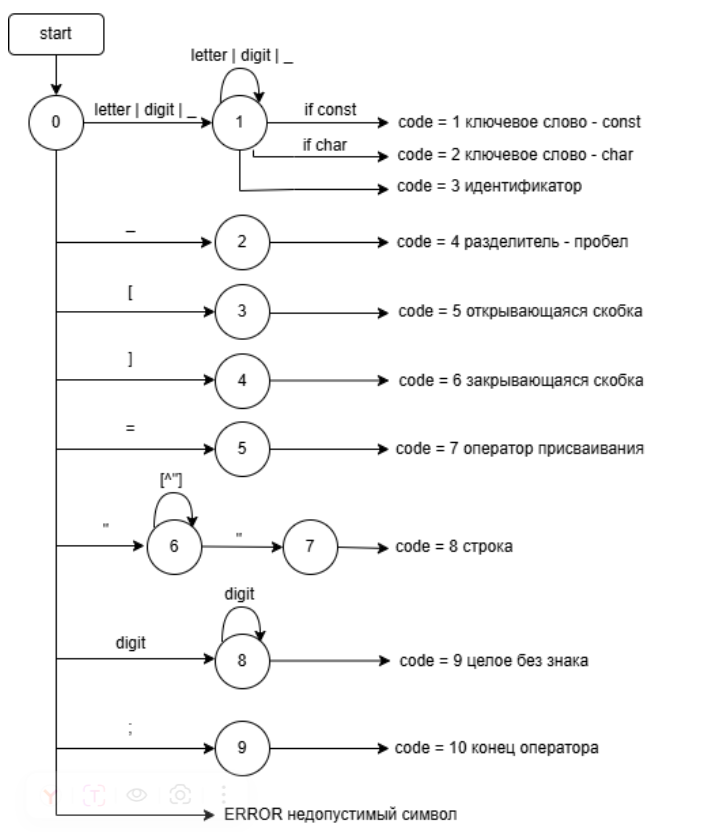
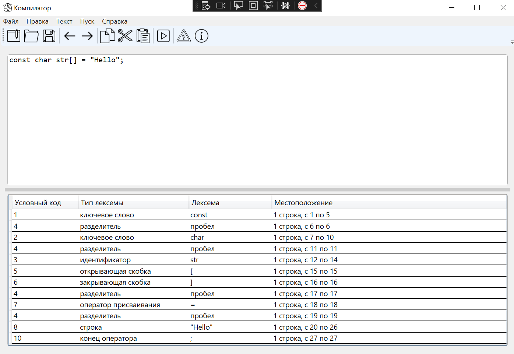
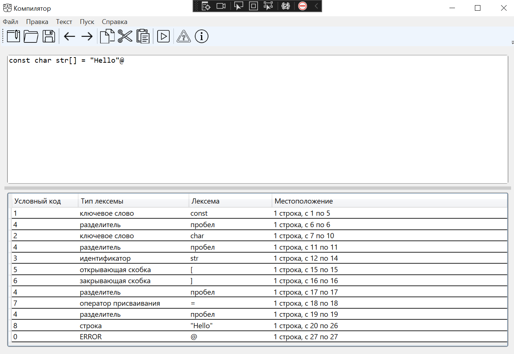
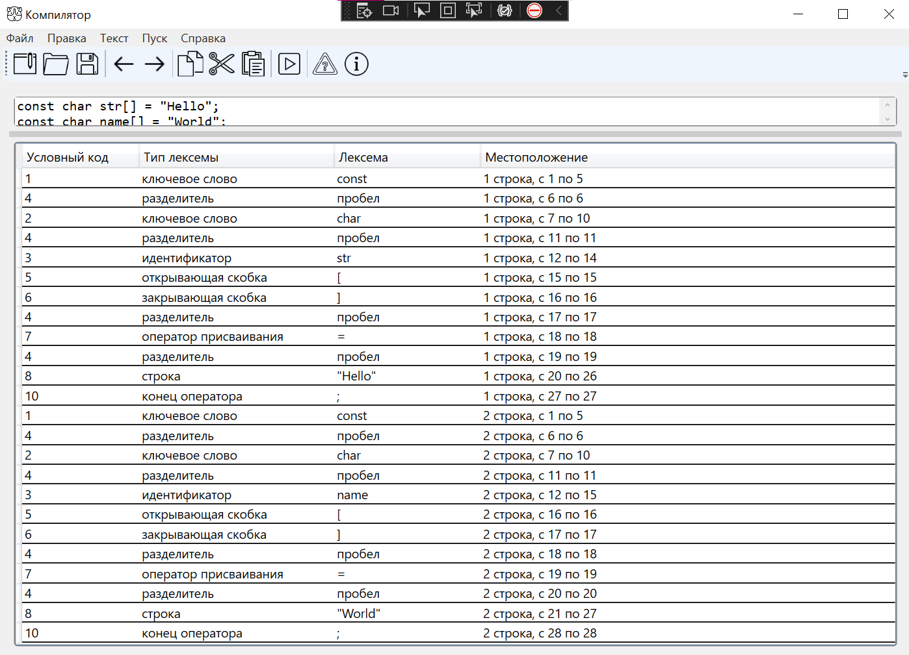

# Лабораторная работа №2

## Разработка лексического анализатора (сканера)

---

# 1. Название и цель лабораторной работы

**Разработка лексического анализатора (сканера)**

### Цель работы

Изучить назначение и принципы работы лексического анализатора в структуре компилятора.
Спроектировать конечный автомат и реализовать программный модуль сканера для выделения лексем из входного текста.

Разработанный сканер интегрируется в графическое приложение, созданное в лабораторной работе №1.

---

# 2. Сведения об авторе

Студент группы **АП-327**

**Пузырный Д.А.**

---

# 3. Постановка задачи

Необходимо разработать **лексический анализатор**, который выполняет следующие функции:

* принимает текст программы из области редактирования;
* последовательно анализирует входную строку;
* выделяет допустимые лексемы;
* классифицирует лексемы по типам;
* определяет местоположение лексемы в тексте;
* обнаруживает недопустимые символы;
* выводит результат анализа в таблицу.

Лексический анализатор реализуется в виде отдельного программного модуля **LexicalAnalyzer**, который возвращает список найденных лексем.

Результаты анализа отображаются в таблице **DataGrid**, содержащей:

* условный код лексемы;
* тип лексемы;
* текст лексемы;
* местоположение в исходном тексте.

Также реализована навигация по ошибкам: при выборе строки таблицы курсор редактора устанавливается на позицию соответствующей лексемы.

---

# 4. Вариант задания

### Вариант № 58 

**Объявление массива символов с инициализацией строковой константой на языке C**

Пример конструкции:

```c
const char str[] = "Hello";
```

---

# 5. Допустимые лексемы

| Код | Тип лексемы           | Пример              |
| --- | --------------------- | ------------------- |
| 1   | ключевое слово        | const               |
| 2   | ключевое слово        | char                |
| 3   | идентификатор         | str                 |
| 4   | разделитель           | пробел              |
| 5   | открывающая скобка    | [                   |
| 6   | закрывающая скобка    | ]                   |
| 7   | оператор присваивания | =                   |
| 8   | строковая константа   | "Hello"             |
| 9   | целое число           | 10                  |
| 10  | конец оператора       | ;                   |
| 0   | ошибка                | недопустимый символ |

---

# 6. Примеры корректных входных строк

### Пример 1

```c
const char str[] = "Hello";
```

---

### Пример 2

```c
const char name[10] = "World";
```

---

### Пример 3

```c
const char text[5] = "Privet";
```

---

# 7. Диаграмма состояний

В работе используется **конечный автомат**, который анализирует входной текст посимвольно и определяет тип лексемы.

Диаграмма состояний:

<p align="center">

</p>

---

# 8. Описание работы автомата

Работа сканера основана на принципе **конечного автомата**.

Алгоритм работы:

1. Автомат находится в **начальном состоянии**.
2. Считывается очередной символ входной строки.
3. В зависимости от типа символа выполняется переход в новое состояние:

   * буква → начало идентификатора;
   * цифра → начало числа;
   * символ `"` → начало строковой константы;
   * символы `[ ] = ;` → отдельные лексемы;
   * пробел → разделитель.
4. Когда лексема полностью распознана, она добавляется в таблицу результатов.
5. Если встречается недопустимый символ, генерируется лексема типа **ERROR**.
6. После обработки символа автомат возвращается в начальное состояние.

---

# 9. Тестовые примеры

## 9.1 Корректная строка

Вход:

```c
const char str[] = "Hello";
```

Выход:

<p align="center">  </p>


## 9.2 Строка с недопустимым символом

Вход:

```c
const char str[] = "Hello"@
```
Выход:

<p align="center">  </p>

## 9.3 Многострочный пример

Вход:

```c
const char str[] = "Hello";
const char name[] = "World";
```

Выход:

<p align="center">  </p>


# 10. Используемые технологии

* Язык программирования: **C#**
* Платформа: **.NET Framework 4.7.2**
* GUI: **WPF**
* Среда разработки: **Microsoft Visual Studio 2022**
* Система контроля версий: **Git**
* Репозиторий: **GitHub**


