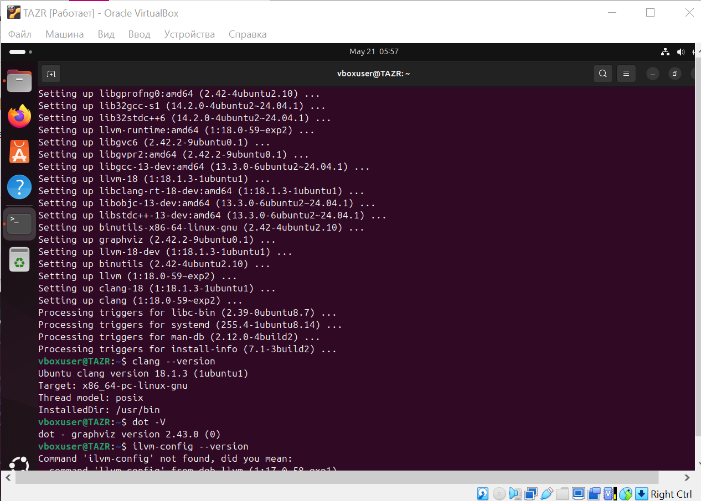
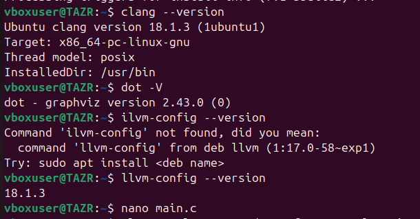
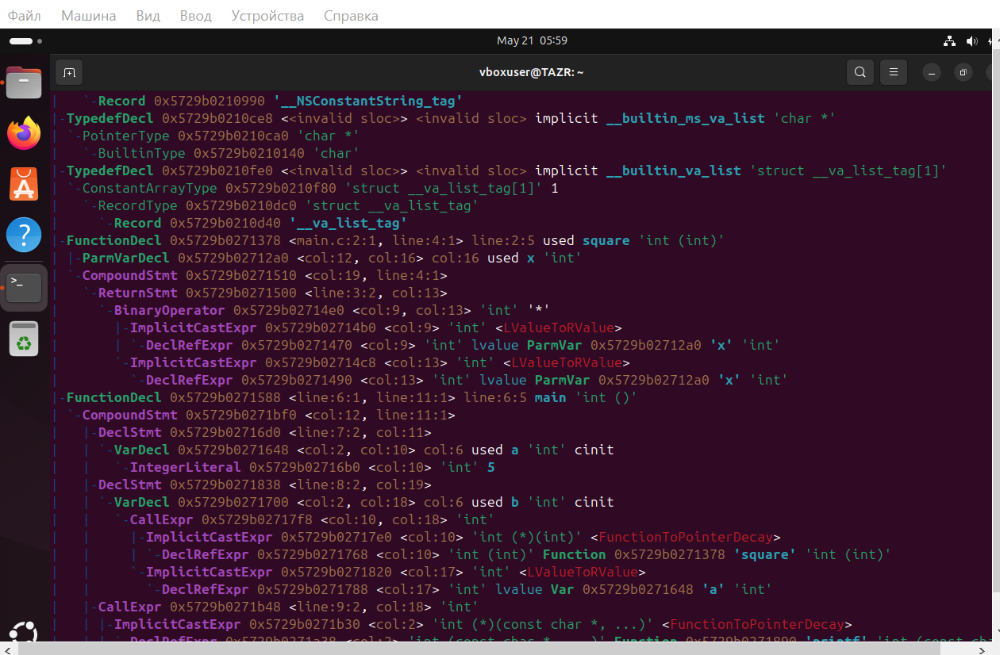
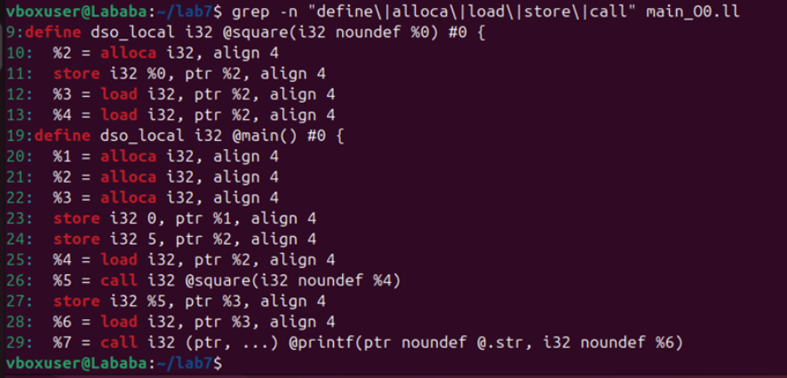
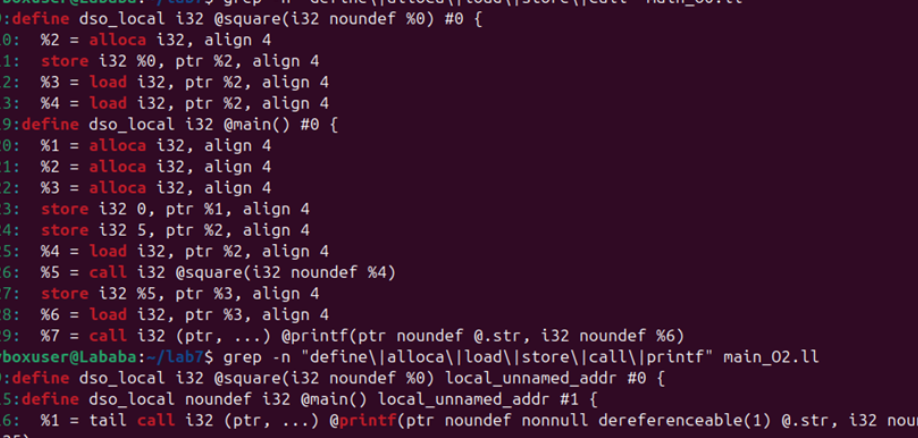
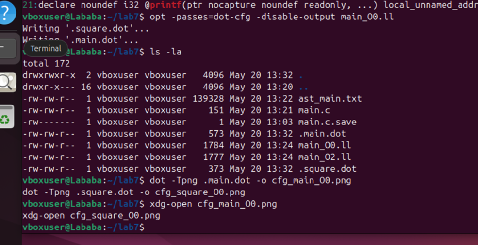
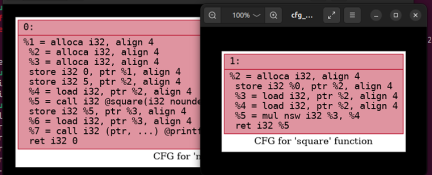
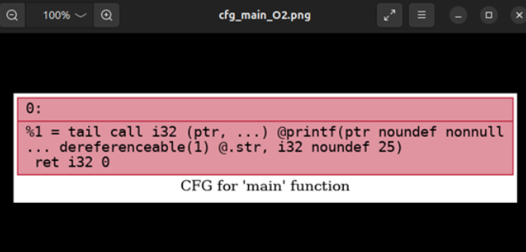
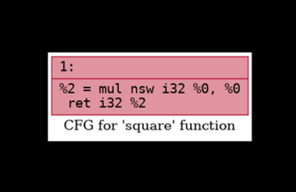

# Лабораторная работа №7
## Анализ и преобразование кода с использованием Clang и LLVM

**Выполнил:** Пузырный Д.А.  
**Группа:** АП -327


# Цель работы

Познакомиться с инструментами Clang и LLVM, научиться собирать AST и IR-промежуточное представление кода на C/C++, а также извлекать базовую информацию о программе (например, список функций).


# Задачи

1. Установить Clang и LLVM;
2. Скомпилировать простой C-файл с использованием clang и получить его:
   - абстрактное синтаксическое дерево (AST),
   - промежуточное представление LLVM IR;
3. Использовать opt для применения базовой комплексной оптимизации (например, О2);
4. Построить граф потока управления (CFG) для оптимизированной программы;
5. Проанализировать результат, сделать выводы и ответить на контрольные вопросы.
6. Выполнить индивидуальное задание в соответствии со своим оператором из КР / РГР.


# Общее задание

## 1. Установка и подготовка среды

Работа выполнялась в Ubuntu, запущенной в Oracle VirtualBox. Для выполнения лабораторной работы были установлены clang, llvm, opt и graphviz.

```bash
sudo apt update
sudo apt install -y clang llvm llvm-dev llvm-runtime graphviz xdg-utils
````



**Рисунок 1 — установка пакетов LLVM, Clang и Graphviz**

После установки были проверены версии основных инструментов. Проверка выполнялась командами clang --version, opt --version, dot -V и llvm-config --version.

```bash
clang --version
opt --version
dot -V
llvm-config --version
```



**Рисунок 2 — проверка версий Clang, opt, Graphviz и создание рабочей папки**


---

## 2. Исходный код main.c

Для освоения инструментов был создан файл main.c с функцией square и функцией main.

```c
#include <stdio.h>

int square(int x) {
    return x * x;
}

int main() {
    int a = 5;
    int b = square(a);
    printf("%d\n", b);
    return 0;
}
```

Функция square принимает целое число и возвращает результат умножения аргумента на самого себя. В функции main значение 5 передается в square, после чего результат выводится через printf.

---

## 3. Работа с AST

Для получения AST использовалась команда clang с параметром -ast-dump. Результат был сохранен в файл ast_main.txt.

```bash
clang -Xclang -ast-dump -fsyntax-only main.c > ast_main.txt
grep -A25 "FunctionDecl.*square" ast_main.txt
grep -A45 "FunctionDecl.*main" ast_main.txt
```



**Рисунок 3 — фрагмент AST для функций square и main**

В AST функция square представлена узлом FunctionDecl. Параметр x отображается как ParmVarDecl, а операция x * x — как BinaryOperator. Функция main также представлена как FunctionDecl, внутри которого видны объявления переменных, вызов square и вызов printf.

---

## 4. Генерация LLVM IR

LLVM IR был создан в двух вариантах: без оптимизации и с оптимизацией уровня -O2.

```bash
clang -O0 -S -emit-llvm main.c -o main_00.ll
clang -O2 -S -emit-llvm main.c -o main_02.ll
```

Для просмотра ключевых инструкций использовалась фильтрация через grep.

```bash
grep -n "define\|alloca\|load\|store\|call" main_00.ll
grep -n "define\|alloca\|load\|store\|call\|printf" main_02.ll
```



**Рисунок 4 — LLVM IR без оптимизации для main.c**



**Рисунок 5 — сравнение ключевых инструкций в IR без оптимизации и после -O2**

В IR без оптимизации присутствуют инструкции alloca, store и load. Это значит, что локальные переменные размещаются в памяти, а значения явно записываются и считываются. Также видно, что функция square вызывается отдельно.

После оптимизации -O2 лишние операции работы с памятью исчезают. Вызов square(5) фактически упрощается до готового значения 25, которое передается в printf. Это показывает работу таких оптимизаций, как встраивание короткой функции, свертка констант и удаление лишних операций.

---

## 5. Оптимизация IR

Сравнение IR до и после оптимизации показывает, что оптимизированное представление становится короче и ближе к SSA-форме. Переменные, которые при -O0 размещались через alloca, после -O2 не требуют явного хранения в памяти.

### Основные изменения после оптимизации:

* удалены лишние alloca, store и load;
* короткая функция square была встроена в место вызова;
* выражение square(5) было вычислено заранее;
* вызов printf получает уже готовый аргумент 25;
* поток управления остался линейным, поскольку в программе нет ветвлений и циклов.

---

## 6. Построение CFG

CFG строился с помощью инструмента opt. Для IR без оптимизации были созданы dot-файлы для функций main и square.

```bash
opt -passes=dot-cfg -disable-output main_00.ll
dot -Tpng .main.dot -o cfg_main_00.png
dot -Tpng .square.dot -o cfg_square_00.png
```



**Рисунок 6 — создание dot-файлов и png-файлов CFG для main.c без оптимизации**



**Рисунок 7 — CFG функций main и square без оптимизации**

После оптимизации -O2 CFG был построен аналогичным способом.

```bash
opt -passes=dot-cfg -disable-output main_02.ll
dot -Tpng .main.dot -o cfg_main_02.png
dot -Tpng .square.dot -o cfg_square_02.png
```



**Рисунок 8 — создание CFG для main.c после оптимизации -O2**



**Рисунок 9 — CFG функции main после оптимизации -O2**


Так как программа не содержит условных операторов и циклов, CFG для каждой функции состоит из одного базового блока. После оптимизации меняется содержимое блока, но структура управления остается линейной.

---


# Индивидуальное задание

## 1. Исходная конструкция

Индивидуальное задание относится к варианту 2.8: строковые константы. Для анализа был создан файл strings.c.

```c
#include <stdio.h>

int main() {
    const char* msg = "Hello, World!";
    printf("%s\n", msg);
    return 0;
}
````

**Рисунок 12 — исходный код strings.c**

image

Строковый литерал "Hello, World!" сохраняется в секции констант программы. Указатель msg содержит адрес этой строки, после чего строка передается в printf для вывода на экран.

---

## 2. AST индивидуального задания

```bash
clang -Xclang -ast-dump -fsyntax-only strings.c > ast_strings.txt
grep -A60 "FunctionDecl.*main" ast_strings.txt
```

**Рисунок 13 — AST функции main для индивидуального задания**

image

В AST видно объявление указателя msg, строковый литерал "Hello, World!" и вызов функции printf. Строка представлена узлом StringLiteral, а вызов printf — узлом CallExpr.

---

## 3. LLVM IR индивидуального задания

```bash
clang -O0 -S -emit-llvm strings.c -o strings_00.ll
clang -O2 -S -emit-llvm strings.c -o strings_02.ll
```

Для просмотра ключевых инструкций были использованы команды grep по словам define, alloca, store, load, private и printf.

```bash
grep -n "define\|alloca\|store\|load\|private\|printf" strings_00.ll
grep -n "define\|alloca\|store\|load\|private\|printf" strings_02.ll
```

**Рисунок 14 — IR strings.c без оптимизации**

image

**Рисунок 15 — сравнение ключевых инструкций IR strings.c до и после оптимизации**

image

В IR без оптимизации присутствуют инструкции alloca, store и load. Строковый литерал хранится как глобальная константа. После применения -O2 лишние операции работы с памятью удаляются, а обращение к строке становится более компактным.

---

## 4. Сравнение IR индивидуального задания

```bash
opt -passes=mergefunc,mergeicmps -S strings_02.ll -o strings_merge.ll
diff strings_02.ll strings_merge.ll
```

**Рисунок 16 — сравнение strings_02.ll и strings_merge.ll через diff**

image

При оптимизации одинаковые строковые литералы могут быть объединены в одну глобальную константу. LLVM старается не дублировать одинаковые строки в памяти, что уменьшает размер итогового бинарного файла.

---

## 5. CFG индивидуального задания

```bash
opt -passes=dot-cfg -disable-output strings_00.ll
dot -Tpng .main.dot -o cfg_strings_00.png
xdg-open cfg_strings_00.png
```

**Рисунок 17 — создание CFG для strings.c без оптимизации**

image

**Рисунок 18 — CFG функции main для strings.c без оптимизации**

image

```bash
opt -passes=dot-cfg -disable-output strings_02.ll
dot -Tpng .main.dot -o cfg_strings_02.png
xdg-open cfg_strings_02.png
```

**Рисунок 19 — CFG функции main для strings.c после оптимизации -O2**

image

Так как в программе отсутствуют условные операторы и циклы, CFG состоит из одного базового блока. После оптимизации изменяется только содержимое блока, но структура управления остается линейной.

---

## 6. Вывод по индивидуальному заданию

На уровне AST строковый литерал "Hello, World!" представлен как узел StringLiteral, а вызов printf — как выражение вызова функции. В LLVM IR строка хранится как глобальная константа. В неоптимизированном IR присутствуют alloca, store и load, однако после применения -O2 лишние операции удаляются. LLVM способен объединять одинаковые строковые литералы, уменьшая объем используемой памяти и размер итогового исполняемого файла.

---

```
```


# Выводы

В ходе лабораторной работы были изучены инструменты Clang и LLVM, предназначенные для анализа и оптимизации программ на языке C. Были получены навыки построения AST, генерации LLVM IR и построения графов потока управления CFG.

На практике было рассмотрено различие между неоптимизированным и оптимизированным IR. Установлено, что оптимизация уровня -O2 удаляет лишние операции работы с памятью, упрощает код и выполняет локальные преобразования, такие как свертка констант и inlining функций.

В индивидуальном задании было исследовано представление строковых литералов в LLVM IR. Было показано, что строковые константы сохраняются как глобальные неизменяемые данные, а одинаковые строки могут объединяться для уменьшения объема памяти и размера итогового исполняемого файла.

В результате работы были получены практические навыки использования clang, opt и graphviz для анализа внутреннего представления программ и изучения работы оптимизаций LLVM.

# Ответы на контрольные вопросы

## 1.

Clang — фронтенд LLVM для C/C++. Роль: парсинг, проверка типов, генерация AST и LLVM IR.

## 2.

LLVM — инфраструктура компиляции, предоставляющая независимое от языка и платформы промежуточное представление (IR). Современные компиляторы (Clang, Rustc) генерируют LLVM IR, а затем LLVM оптимизирует и транслирует его в машинный код.

## 3.

AST — высокоуровневое, сохраняет структуру исходного языка (циклы, ветвления). LLVM IR — низкоуровневое, в SSA-форме, предназначено для оптимизаций и машинно-независимого анализа.

## 4.

IR нужно для независимости от языка и архитектуры, повторного использования оптимизаций и упрощения анализа (единое представление).

## 5.

alloca выделяет память на стеке для локальной переменной. Используется в неоптимизированном коде (-O0) и когда необходим адрес переменной; в оптимизированных версиях часто заменяется регистрами (SSA).

## 6.

Оптимизация нужна для ускорения работы программы, уменьшения размера бинарного файла, снижения энергопотребления.

## 7.

SSA-форма (Static Single Assignment) — каждая переменная присваивается ровно один раз. Это упрощает анализ потока данных, позволяет точно отслеживать зависимости и выполнять оптимизации (например, распространение констант, устранение мёртвого кода).

## 8.

CFG — граф, где вершины — базовые блоки (линейные фрагменты), рёбра — переходы между ними. Помогает анализировать возможные пути выполнения, удалять недостижимый код, оптимизировать циклы и т.д.

## 9.

Арифметические операции в LLVM IR типизированы:

```llvm
%res = add i32 %a, %b
%res = mul i32 %a, %b
```

Тип (i32, i64, float) указывается явно.

## 10.

Функции — это независимые единицы компиляции: они имеют свои локальные переменные, изолированы от остальных. Это позволяет оптимизировать их параллельно, а также выполнять межпроцедурные оптимизации (например, inlining) без побочных эффектов.

## 11.

Короткая функция, вызываемая один раз, скорее всего, будет встроена (inlined) — её тело скопируется в место вызова, а сама функция удалится. Это убирает накладные расходы на вызов и может открыть новые возможности для дальнейших оптимизаций.

## 12.

IR проще и не содержит синтаксического сахара, макросов, сложных приведений типов. CFG явно показывает все переходы. Это делает автоматический анализ детерминированным, точным и не зависящим от случайных особенностей исходного текста (например, от форматирования или сложных выражений).

---

# Список использованных команд

```bash
sudo apt update
sudo apt install -y clang llvm llvm-dev llvm-runtime graphviz xdg-utils

clang --version
opt --version
dot -V
llvm-config --version

mkdir -p ~/lab7
cd ~/lab7

clang -Xclang -ast-dump -fsyntax-only main.c > ast_main.txt
clang -O0 -S -emit-llvm main.c -o main_00.ll
clang -O2 -S -emit-llvm main.c -o main_02.ll

opt -passes=dot-cfg -disable-output main_00.ll
opt -passes=dot-cfg -disable-output main_02.ll

clang -Xclang -ast-dump -fsyntax-only notation.c > ast_notation.txt
clang -O0 -S -emit-llvm notation.c -o notation_00.ll
clang -O2 -S -emit-llvm notation.c -o notation_02.ll
diff notation_00.ll notation_02.ll

opt -passes=dot-cfg -disable-output notation_00.ll
opt -passes=dot-cfg -disable-output notation_02.ll
```

```
